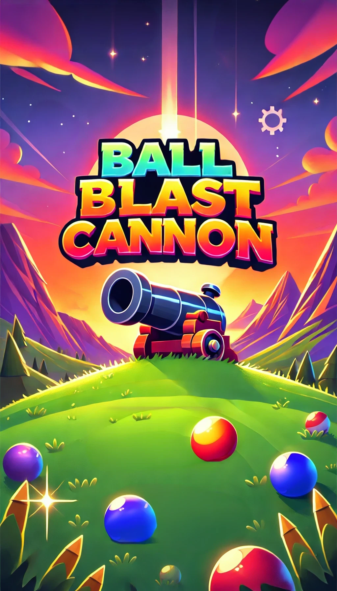

# Ball Blast Cannon

A fun and addictive arcade-style game where you control a cannon to destroy falling balls before they hit you!



## 🎮 Game Overview

Ball Blast Cannon is an engaging HTML5 game built with p5.js. Control a cannon at the bottom of the screen and shoot bullets to destroy descending balls. Each ball has a health value displayed on it, and you need to hit it multiple times to destroy it. As you progress through levels, balls become more numerous and tougher.

## 🚀 Features

- **Responsive Design**: Adapts to different screen sizes and orientations
- **Touch Support**: Works on mobile devices with touch controls
- **Particle Effects**: Satisfying visual effects when destroying balls
- **Level Progression**: Increasing difficulty as you advance
- **Score System**: Earn points by destroying balls with bonuses for bigger balls
- **Dynamic UI**: Animated score counters, level indicators, and game-over screen
- **Animated Background**: Dynamic cloud elements and visual effects

## 🎯 How to Play

1. **Controls**:

   - **Mouse/Touch**: Move the cannon left and right
   - **Automatic Shooting**: The cannon fires automatically
   - **Space Bar**: Manual firing (on desktop)

2. **Objective**:

   - Destroy all balls before they hit your cannon
   - Advance through levels by clearing all balls on screen
   - Achieve the highest score possible

3. **Scoring**:
   - Each hit on a ball awards points based on damage dealt
   - Destroying a ball gives bonus points based on its size
   - Higher levels give opportunities for higher scores

## 💻 Technical Implementation

The game is built using:

- **HTML5**: Structure
- **CSS3**: Styling and responsive design
- **JavaScript**: Game logic
- **p5.js**: Canvas rendering and animation

### Project Structure

- **index.html**: Main game container
- **style.css**: Game styling
- **js/**: JavaScript files
  - **main.js**: Game initialization and loop
  - **game.js**: Game state management and UI
  - **cannon.js**: Player-controlled cannon logic
  - **ball.js**: Ball mechanics and physics
  - **bullet.js**: Projectile logic
  - **background.js**: Background rendering

## 🚀 Getting Started

### Play Online

Simply visit [Game URL] to play the game directly in your browser.

### Local Installation

1. Clone the repository:

   ```
   git clone https://github.com/yourusername/ball_blast_cannon.git
   ```

2. Open the `index.html` file in a web browser.

3. No build process or additional dependencies required!

## 🎨 Game Design

- **Visual Style**: Colorful, arcade-style graphics with particle effects
- **Sound Design**: Satisfying sound effects for shooting and destroying balls
- **Difficulty Curve**: Progressive challenge as players advance
- **UI/UX**: Clean interface with animated elements and intuitive controls

## 🧠 Development Insights

The game implements several interesting features:

- Collision detection between bullets and balls
- Particle system for visual effects
- Responsive design that scales to any device
- Game state management for different screens
- Touch support for mobile gameplay

## 🔮 Future Enhancements

Potential features for future updates:

- Power-ups and special abilities
- Multiple cannon types
- Achievement system
- Local high score storage
- Sound settings and customization

## 📝 License

[Your chosen license]

## 👤 Credits

Developed by [Your Name/Team]

Assets and inspiration credits:

- Game concept inspired by popular mobile games
- Graphics created using [tools used]
- Sound effects from [source if applicable]

---

Enjoy the game and happy blasting! 🎮
